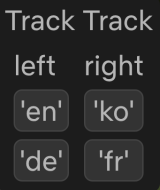
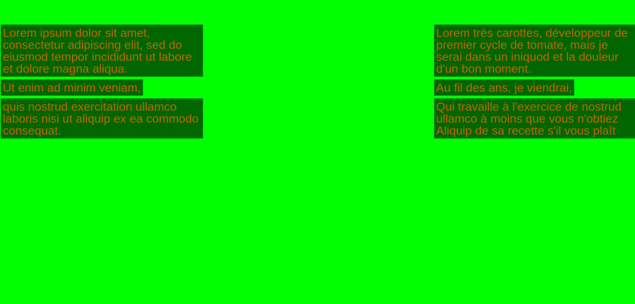

# Track Track

This project is not really maintained; it was mostly written around the year 2020.

## Table of Contents

  - [Features](#features)
  - [Example Pictures](#example)
  - [Installation](#installation)
  - [Bugs & Limitations](#bugs-limitations)
  - [Terminology](#terminology)
  - [How it works](#how-it-works)

## Features {#features}

This project is a subtitle-related chrome / chromium extension that works on the following websites.

  * [netflix](https://www.netflix.com/)
  * [viki](https://www.viki.com/)
  * [youtube](https://www.youtube.com/)

This extension has the following features (also see [Bugs & Limitations section](#bugs-limitations))

  * Two different [subtitle tracks](#terminology) can be displayed simultaneously (see [picture below](#example-subtitle-display)).
    * Hence the name.
    * One track is displayed on the left side of the screen.
    * One track is displayed on the right side of the screen.
  * A GUI is overlayed onto the site in which subtitle tracks can be selected for each side (see [picture below](#example-GUI)).
    * The GUI is only visible when the mouse hovers over its position
    * It is placed on the top middle of the site
  * The duration of each individual subtitle [cue](#terminology) is doubled (while keeping the start time)
    This allows for …
      * … easier reading of subtitles in a language one does not have a good command of.
      * … easier reading of subtitles when the playback speed of the watched video is increased.

## Roadmap {#roadmap}

  * fix youtube
  * customizable subtitle duration in the UI

## Example Pictures {#example}

### GUI {#example-GUI}

### Subtitle display {#example-subtitle-display}

The following picture shows a mock-up example with the following properties

  * Two tracks are displayed simultaneously (one on the left and one on the right).
  * For each track multiple cues are shown.
  * On the left side some [Lorem ipsum](https://en.wikipedia.org/wiki/Lorem_ipsum) text is shown
    and on the right side the translation of this text to French according to the google translator.
  * Instead of showing a video the background is just green.

## Installation {#installation}
  1) Download this repository.
  2) In Chrome / Chromium go to "Settings" → "Extensions"
  3) Enable "Developer mode" (toggle at the top right).
  4) Click "Load unpacked" and select the repository directory from the first step.
  5) Make sure the extension loaded and is enabled

Now the features described above are available on the supported websites (see [above](#features)).

## Bugs & Limitations {#bugs-limitations}
  * Hardcoded language selection (for my personal use)
      * left:  'en' (English) / 'de' (German)
      * right: 'ko' (Korean) / 'fr' (French)

    The language selection can be changed by modifying the created buttons in `./injected_scripts/init.js` (c.f. the line `vtt1_control.appendChild(TT.mk_select_lang_button("en", TT.vtt1_info, site));` and the following lines).
    The language should be given as [bcp47 tag](https://en.wikipedia.org/wiki/IETF_language_tag) (like 'en' for English).
  * Hardcoded font size
      * may be adjusted in `./styles.css`
  * Hardcoded subtitle cue duration (doubled duration, same start time)
      * see variable `DURATION_INCREASE` in `./injected_scripts/sub/SHARED.js`
  * GUI can only be moved by clicking on the header and then clicking where it should be moved
  * There is not much error handling
  * After changing the video (e.g. due to auto-play) the subtitle tracks have to be re-selected
  * youtube specific: after changing the video by following a link or due to auto-play the page needs to be refreshed; else the correct subtitles can not be downloaded / used
  * parsing of subtitles may need improvement; some remaining HTML entities
    * some but not all HTML entities (e.g. "&quot") are transformed to their corresponding character (e.g. "'" for "&quot")
  * netflix specific: selecting the text of a displayed cue is not possible

## Terminology {#terminology}
  * A **subtitle track** (or just **subtitle**) basically is a list of timespan and text pairs.
    The timespan part indicates when and for how long the associated text should be displayed (as overlay on the video).
    * Different Languages have different subtitle tracks.
  * Each of these time and text pairs is also called a **cue**.

## How it works {#how-it-works}

Javascript is injected into the site (by `./prepare.js`).
The injected scripts are the files in `./injected_scripts/` (and its subdirectory `./injected_scripts/sub`).
This allows the scripts to be written as if they were part of the site they were injected into.

When e.g. selecting the language with [bcp47 tag](https://en.wikipedia.org/wiki/IETF_language_tag) 'en' (for English) in the GUI (for the left side of the screen) the following happens.
The injected Javascript tries to fetch the subtitle track for 'en' (as text file).
On success transforms the subtitle track to a [\<track\> element](https://developer.mozilla.org/en-US/docs/Web/HTML/Element/track) representing this subtitle track (with the updated duration).
In the process the duration of each cue in the subtitle track is doubled (c.f. [Features section](#features) and [Bugs & Limitations section](#bugs-limitations))
This element is added as child to the [\<video\> element](https://developer.mozilla.org/en-US/docs/Web/HTML/Element/video).
With help of the ['cuechange' event](https://developer.mozilla.org/en-US/docs/Web/HTML/Element/track#detecting_cue_changes) of the \<track\> the cues are displayed at the correct timespan of the video (on the left side of the screen).

The injected scripts can be roughly divided into the following 2 categories:

  * `./injected_scripts/init.js` and `./injected_scripts/TT.js` make up the "core" of the extension.
    * `./injected_scripts/init.js` is responsible to create the overlayed GUI with the help of the functions located in `./injected_scripts/TT.js`.
    * `./injected_scripts/TT.js` basically contains all the logic except how to fetch subtitles and create [\<track\> elements](https://developer.mozilla.org/en-US/docs/Web/HTML/Element/track) out of them.
  * `./injected_scripts/sub/` contains the code to fetch a subtitle track (one language) and transform it to a [\<track\> element](https://developer.mozilla.org/en-US/docs/Web/HTML/Element/track) representing this subtitle track.
    * `./injected_scripts/sub/netflix.js` contains the code specific to [netflix](https://www.netflix.com/).
      * The idea how to obtain the URLs to download the individual subtitle tracks from netflix was found in
        (a now older version of) the 'easysubs' chromium extension (<https://github.com/Nitrino/easysubs>).
        See `./injected_scripts/sub/netflix.js` for details.
    * `./injected_scripts/sub/viki.js` contains the code specifi to [viki](https://www.viki.com/).
    * `./injected_scripts/sub/youtube.js` contains the code specific to [youtube](https://www.youtube.com/).
      * The Idea to use `ytInitialPlayerResponse` to retrieve the URLs to download the individual subtitle tracks from youtube was inspired by <https://stackoverflow.com/a/68711617> and found in <https://stackoverflow.com/a/74770780>.
        See `./injected_scripts/sub/youtube.js` for details.
    * `./injected_scripts/sub/SHARED.js` contains the code that is used for multiple of the supported websites.

